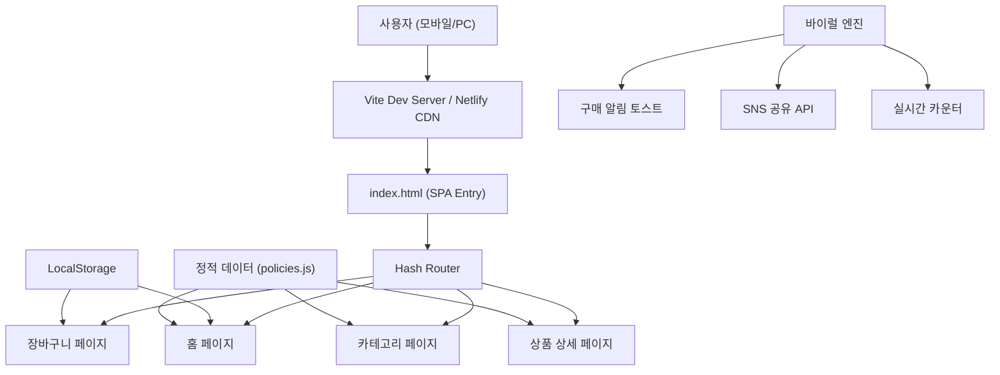

# 🏪 군산 1번가 — 정책 쇼핑몰 개발 계획서

> **"군산의 미래, 장바구니에 담으세요!"**
>
> 8인 예비경선 승리를 위한 디지털 핵심 병기 — 시민이 공약을 '구매'하고 지지하는 혁신적 정책 쇼핑몰

---

## 1. 프로젝트 개요

### 1.1 목적
- 딱딱한 선거 공보물을 **모바일 쇼핑 경험**으로 전환
- 시민이 후보의 정책(공약)을 상품처럼 탐색 → 장바구니 담기 → 지지(결제) → SNS 공유하는 **풀 퍼널 경험** 설계
- **바이럴 엔진** 내장으로 자연 확산 유도

### 1.2 핵심 타깃
- 군산시 유권자 (모바일 중심 접근)
- 20~50대 스마트폰 사용자
- SNS 활동이 활발한 지지층

### 1.3 D-Day 일정

| 일자 | 마일스톤 |
|:---|:---|
| **3/31** | 🎉 군산 1번가 **그랜드 오픈** + '찍을래말래' 챌린지 시작 |
| **4월 초** | 카테고리별 공약 상세 분석 라이브 스트리밍 |
| **경선 피크** | 지지율 완판 + 여론조사 참여(02 전화 받기) 집중 배너 노출 |

---

## 2. 기술 스택 및 아키텍처

### 2.1 기술 선택

| 영역 | 기술 | 이유 |
|:---|:---|:---|
| **빌드 도구** | Vite (Vanilla JS) | 빠른 HMR, 경량, 즉시 배포 가능 |
| **언어** | HTML5 + CSS3 + JavaScript (ES Modules) | 프레임워크 없이 빠른 개발, 유지보수 용이 |
| **스타일링** | Vanilla CSS (Custom Properties) | 다크 테마 + 동적 테마 전환 지원 |
| **라우팅** | Hash-based SPA Router | 서버 설정 불필요, 정적 호스팅 호환 |
| **상태 관리** | LocalStorage + 이벤트 기반 | 장바구니, 사용자 선호도 저장 |
| **배포** | Netlify | 무료, 빠른 CDN, 즉시 배포 |
| **폰트** | Pretendard / Noto Sans KR | 한국어 최적화 타이포그래피 |

### 2.2 아키텍처 다이어그램



---

## 3. 디자인 시스템

### 3.1 컬러 팔레트

> [!IMPORTANT]
> 더불어민주당의 블루 아이덴티티를 기반으로 하되, 쇼핑몰 특유의 **프리미엄 다크 테마**로 차별화합니다.

| 역할 | 컬러 | 코드 | 용도 |
|:---|:---|:---|:---|
| **Primary** | 💙 브라이트 블루 | `#1A73E8` | CTA 버튼, 링크, 강조 |
| **Primary Dark** | 🔵 딥 블루 | `#1557B0` | 호버, 액티브 상태 |
| **Accent Gold** | 🟡 골드 | `#FFD700` | 뱃지, 별점, 특가 태그 |
| **Accent Red** | 🔴 코랄 레드 | `#FF6B6B` | 마감 임박, 긴급 CTA |
| **Success** | 🟢 그린 | `#4CAF50` | 구매 완료, 성공 알림 |
| **BG Dark** | 🌑 네이비 | `#0F1923` | 메인 배경 |
| **Surface** | 🌘 다크 슬레이트 | `#1A2634` | 카드, 섹션 배경 |
| **Surface Light** | 🌗 미드 슬레이트 | `#243447` | 호버 카드, 입력 필드 |
| **Text Primary** | ⬜ 화이트 | `#FFFFFF` | 제목, 주요 텍스트 |
| **Text Secondary** | 🔘 쿨 그레이 | `#B0BEC5` | 부가 설명, 메타 정보 |

### 3.2 타이포그래피

```css
/* 폰트 스택 */
--font-primary: 'Pretendard', 'Noto Sans KR', -apple-system, sans-serif;
--font-display: 'Outfit', 'Pretendard', sans-serif;

/* 크기 시스템 */
--text-xs: 0.75rem;    /* 12px - 뱃지, 캡션 */
--text-sm: 0.875rem;   /* 14px - 부가 설명 */
--text-base: 1rem;     /* 16px - 본문 */
--text-lg: 1.125rem;   /* 18px - 카드 제목 */
--text-xl: 1.25rem;    /* 20px - 섹션 제목 */
--text-2xl: 1.5rem;    /* 24px - 페이지 제목 */
--text-3xl: 2rem;      /* 32px - 히어로 타이틀 */
--text-4xl: 2.5rem;    /* 40px - 메인 슬로건 */
```

### 3.3 그리드 & 간격

```css
/* 그리드 시스템 */
--grid-cols-mobile: 2;
--grid-cols-tablet: 3;
--grid-cols-desktop: 4;
--grid-gap: 1rem;

/* 간격 */
--space-xs: 0.25rem;
--space-sm: 0.5rem;
--space-md: 1rem;
--space-lg: 1.5rem;
--space-xl: 2rem;
--space-2xl: 3rem;
```

### 3.4 컴포넌트 스타일 규칙

- **카드**: `border-radius: 16px`, 미세한 `box-shadow`, 호버 시 `translateY(-4px)` + 그림자 확대
- **버튼**: `border-radius: 12px`, 풀 너비(모바일), 물결 효과(ripple) 애니메이션
- **배지**: `border-radius: 20px`, 작은 글씨 + 강조 배경색
- **토스트 알림**: 하단에서 슬라이드업, 3초 후 자동 사라짐
- **글래스모피즘**: `backdrop-filter: blur(20px)` + 반투명 배경 (상단 네비, 모달)

---

## 4. 페이지 & 컴포넌트 설계

### 4.1 메인 홈 페이지 (`#/` or `#/home`)

```
┌──────────────────────────────────┐
│  🔍 군산 1번가    🛒(3)  ≡      │  ← 글래스모피즘 헤더
├──────────────────────────────────┤
│ ┌──────────────────────────────┐ │
│ │   🎉 군산 1번가 그랜드 오픈!  │ │  ← 히어로 배너 캐러셀
│ │   군산의 미래, 장바구니에     │ │
│ │   담으세요!                   │ │
│ │   [지금 쇼핑하기 →]          │ │
│ └──────────────────────────────┘ │
│                                  │
│ ⏰ D-Day 카운트다운: 00:12:34:56│  ← 실시간 카운트다운
│                                  │
│ [베스트🔥] [MD추천💎] [마감⚡]  │  ← 카테고리 탭
│                                  │
│ ┌────────┐ ┌────────┐           │
│ │ 🚀     │ │ 📢     │           │  ← 상품 카드 그리드
│ │경제    │ │행정     │           │
│ │로켓배송│ │직송     │           │
│ │ ★★★★☆ │ │ ★★★★★  │           │
│ │1,234명 │ │ 987명  │           │
│ │[담기🛒]│ │[담기🛒]│           │
│ └────────┘ └────────┘           │
│                                  │
│ 📣 방금 나운동 시민이            │  ← 실시간 구매 알림
│    '오픈 시장실'을 구매!         │
│                                  │
├──────────────────────────────────┤
│  🏠    📂    🛒    👤           │  ← 하단 네비게이션
└──────────────────────────────────┘
```

**구성 요소:**
- 글래스모피즘 헤더 (로고 + 장바구니 아이콘 + 햄버거 메뉴)
- 히어로 배너 캐러셀 (자동 슬라이드, 3장)
- D-Day 카운트다운 타이머
- 카테고리 탭 (가로 스크롤)
- 상품 카드 그리드 (2열 모바일 / 3~4열 데스크탑)
- 실시간 구매 알림 토스트
- 하단 고정 네비게이션 바

### 4.2 상품 상세 페이지 (`#/product/:id`)

```
┌──────────────────────────────────┐
│  ← 뒤로   군산 경제 로켓배송  🛒 │
├──────────────────────────────────┤
│ ┌──────────────────────────────┐ │
│ │                              │ │  ← 대형 이미지/영상
│ │   [정책 이미지 슬라이더]      │ │
│ │                              │ │
│ └──────────────────────────────┘ │
│  ○ ● ○                          │
│                                  │
│ 🔥베스트  경제/산업              │  ← 태그 뱃지
│                                  │
│ 군산 경제 로켓배송               │  ← 정책 타이틀
│ ─────────────────                │
│ 현대중공업, GM 폐쇄의 아픔을     │  ← 상세 설명
│ 딛고 이재명표 산업 전환 구현     │
│                                  │
│ ⭐⭐⭐⭐⭐ 1,234명 지지          │  ← 지지 수
│                                  │
│ ┌────────────────────────────┐   │
│ │ 📋 공약 상세              │   │  ← 접이식 상세
│ │ • 첨단 산업단지 유치        │   │
│ │ • 청년 일자리 5,000개 창출  │   │
│ │ • 중소기업 지원 패키지      │   │
│ └────────────────────────────┘   │
│                                  │
│ 💬 시민 리뷰 (156)              │  ← 리뷰 섹션
│ ┌────────────────────────────┐   │
│ │ 나운동 시민 ⭐⭐⭐⭐⭐       │   │
│ │ "이 공약 정말 필요해요!"    │   │
│ │                            │   │
│ │ 🏷️ 판매자(후보자) 답변:     │   │
│ │ "반드시 실현하겠습니다!"    │   │
│ └────────────────────────────┘   │
│                                  │
│ 📦 관련 상품                     │  ← 연관 정책 추천
│ ┌────┐ ┌────┐ ┌────┐            │
│ └────┘ └────┘ └────┘            │
│                                  │
├──────────────────────────────────┤
│ [🛒 장바구니 담기]  [📤 공유]    │  ← 고정 하단 CTA
└──────────────────────────────────┘
```

### 4.3 장바구니 페이지 (`#/cart`)

```
┌──────────────────────────────────┐
│  ← 뒤로   내 장바구니 (3)       │
├──────────────────────────────────┤
│                                  │
│ ┌──────────────────────────────┐ │
│ │ ☑ 군산 경제 로켓배송     ✕  │ │  ← 정책 아이템
│ │   경제/산업                  │ │
│ └──────────────────────────────┘ │
│ ┌──────────────────────────────┐ │
│ │ ☑ 춘추관장 직송 행정     ✕  │ │
│ │   소통/행정                  │ │
│ └──────────────────────────────┘ │
│ ┌──────────────────────────────┐ │
│ │ ☑ 54세 젊은 동력 패키지  ✕  │ │
│ │   청년/미래                  │ │
│ └──────────────────────────────┘ │
│                                  │
│ ══════════════════════════════   │
│ 총 지지 공약: 3개               │
│ 완판까지: 1,997명 남음           │
│ ══════════════════════════════   │
│                                  │
├──────────────────────────────────┤
│ [💙 지지 결제하기 (SNS 공유)]    │  ← 결제 = SNS 공유
└──────────────────────────────────┘
```

### 4.4 컴포넌트 상세

| 컴포넌트 | 파일 | 설명 |
|:---|:---|:---|
| **Header** | `components/header.js` | 글래스모피즘 상단바, 로고, 장바구니 뱃지, 햄버거 |
| **HeroBanner** | `components/heroBanner.js` | 자동 슬라이드 캐러셀, 터치 스와이프 지원 |
| **CategoryTabs** | `components/categoryTabs.js` | 가로 스크롤 카테고리 필터 탭 |
| **ProductCard** | `components/productCard.js` | 정책 카드 (이미지, 제목, 지지수, CTA) |
| **ProductDetail** | `pages/detail.js` | 정책 상세 뷰 (이미지 슬라이더, 설명, 리뷰) |
| **Cart** | `pages/cart.js` | 장바구니 리스트 + 결제(공유) CTA |
| **ReviewSection** | `components/reviewSection.js` | 시민 리뷰 + 판매자 답변 |
| **Toast** | `components/toast.js` | 실시간 구매 알림 팝업 |
| **Countdown** | `components/countdown.js` | D-Day 카운트다운 타이머 |
| **BottomNav** | `components/bottomNav.js` | 모바일 하단 네비게이션 바 |
| **ShareModal** | `components/shareModal.js` | SNS 공유 모달 (카카오, 페이스북, 트위터) |

---

## 5. 데이터 모델

### 5.1 정책(상품) 데이터 구조

```javascript
// data/policies.js
const policies = [
  {
    id: "economy-rocket",
    category: "economy",        // economy | communication | youth
    badge: "best",              // best | md-pick | closing-soon
    title: "군산 경제 로켓배송",
    subtitle: "이재명표 산업 대전환",
    description: "현대중공업, GM 폐쇄의 아픔을 딛고...",
    details: [
      "첨단 산업단지 유치",
      "청년 일자리 5,000개 창출",
      "중소기업 혁신 지원 패키지"
    ],
    image: "/assets/images/economy-rocket.webp",
    supporters: 1234,
    rating: 4.8,
    reviews: [
      {
        author: "나운동 시민",
        rating: 5,
        text: "이 공약 정말 필요해요!",
        reply: "반드시 실현하겠습니다! - 김재준"
      }
    ],
    relatedIds: ["comm-direct", "youth-54"]
  },
  // ... 추가 정책들
];
```

### 5.2 카테고리 데이터

```javascript
const categories = [
  { id: "best",         label: "베스트 🔥", filter: p => p.badge === "best" },
  { id: "md-pick",      label: "MD 추천 💎", filter: p => p.badge === "md-pick" },
  { id: "closing-soon", label: "마감 임박 ⚡", filter: p => p.badge === "closing-soon" },
  { id: "all",          label: "전체 보기",   filter: () => true }
];
```

### 5.3 장바구니 (LocalStorage)

```javascript
// 저장 형식
{
  "gunsan1st_cart": ["economy-rocket", "comm-direct", "youth-54"],
  "gunsan1st_supported": true  // 결제(공유) 완료 여부
}
```

---

## 6. 바이럴 엔진 상세 설계

### 6.1 실시간 구매 알림 토스트

```javascript
// 군산 지역 동네 목록에서 랜덤 선택
const neighborhoods = [
  "나운동", "수송동", "조촌동", "미장동", "월명동",
  "영화동", "중앙동", "해망동", "소룡동", "오식도동"
];

// 7~15초 간격으로 랜덤 알림 표시
// "방금 {동네} 시민께서 '{정책명}'을 구매(지지)하셨습니다!"
```

### 6.2 SNS 공유 연동

| 플랫폼 | 구현 방식 |
|:---|:---|
| **카카오톡** | Kakao JS SDK `sendDefault` |
| **페이스북** | `FB.ui({ method: 'share' })` |
| **트위터/X** | Intent URL `twitter.com/intent/tweet` |
| **URL 복사** | `navigator.clipboard.writeText()` |

### 6.3 D-Day 카운트다운

- 경선일까지 실시간 카운트다운 (일:시:분:초)
- 카운트다운 종료 시 "🎉 오늘이 경선일입니다! 02 전화 꼭 받아주세요!" 메시지 전환

---

## 7. 파일 구조

```
d:\ainsoft\kim_mall\
├── index.html                    # SPA 엔트리포인트
├── package.json                  # Vite 설정
├── vite.config.js                # Vite 빌드 설정
│
├── css/
│   ├── variables.css             # CSS Custom Properties (색상, 폰트, 간격)
│   ├── reset.css                 # CSS Reset + 기본 스타일
│   ├── layout.css                # 그리드, 컨테이너, 섹션 레이아웃
│   ├── components.css            # 카드, 버튼, 배지, 입력창 등
│   └── animations.css            # 키프레임 애니메이션, 트랜지션
│
├── js/
│   ├── main.js                   # 앱 초기화 + 라우터 연결
│   ├── router.js                 # Hash 기반 SPA 라우터
│   │
│   ├── data/
│   │   ├── policies.js           # 정책(상품) 데이터
│   │   └── config.js             # 앱 설정 (D-Day 날짜, 동네 목록 등)
│   │
│   ├── components/
│   │   ├── header.js             # 상단 헤더 (글래스모피즘)
│   │   ├── bottomNav.js          # 하단 네비게이션
│   │   ├── heroBanner.js         # 히어로 배너 캐러셀
│   │   ├── categoryTabs.js       # 카테고리 탭 네비
│   │   ├── productCard.js        # 정책 상품 카드
│   │   ├── reviewSection.js      # 시민 리뷰 + 판매자 답변
│   │   ├── toast.js              # 구매 알림 토스트
│   │   ├── countdown.js          # D-Day 카운트다운 타이머
│   │   └── shareModal.js         # SNS 공유 모달
│   │
│   ├── pages/
│   │   ├── home.js               # 메인 홈 페이지
│   │   ├── category.js           # 카테고리 페이지
│   │   ├── detail.js             # 상품 상세 페이지
│   │   └── cart.js               # 장바구니 페이지
│   │
│   └── utils/
│       ├── cart.js               # 장바구니 관리 (LocalStorage)
│       ├── share.js              # SNS 공유 유틸리티
│       └── animations.js         # 애니메이션 유틸리티
│
└── public/
    ├── assets/
    │   └── images/               # 정책 이미지, 배너 이미지
    ├── favicon.ico
    └── og-image.png              # SNS 공유 시 미리보기 이미지
```

---

## 8. 개발 로드맵 (6단계)

> [!IMPORTANT]
> **D-Day가 3/31입니다.** 핵심 기능 우선 개발 후 점진적으로 기능을 추가합니다.

### Phase 1: 프로젝트 초기화 & 디자인 시스템 🏗️
- Vite 프로젝트 생성
- CSS 디자인 시스템 구축 (변수, 리셋, 레이아웃, 컴포넌트, 애니메이션)
- 기본 HTML 구조 + SPA 라우터 설정
- Google Fonts 연동 (Pretendard, Outfit)

### Phase 2: 메인 홈 페이지 🏠
- 글래스모피즘 헤더 구현
- 히어로 배너 캐러셀 (자동 슬라이드 + 스와이프)
- D-Day 카운트다운 타이머
- 카테고리 탭
- 상품 카드 그리드

### Phase 3: 상품 상세 & 리뷰 📄
- 상세 페이지 레이아웃
- 이미지 슬라이더
- 공약 상세 설명 (접이식)
- 시민 리뷰 섹션 + 판매자 답변
- 관련 상품 추천

### Phase 4: 장바구니 & 결제(공유) 🛒
- 장바구니 추가/삭제 (LocalStorage)
- 장바구니 페이지 UI
- 결제(지지 확정) → SNS 공유 모달
- 카카오톡 / 페이스북 / X 공유 연동

### Phase 5: 바이럴 엔진 🚀
- 실시간 구매 알림 토스트 (랜덤 동네 + 정책)
- 지지자 카운터 애니메이션
- 마감 임박 긴박감 효과 (펄스, 색상 변화)

### Phase 6: 폴리싱 & 배포 ✨
- 반응형 디자인 최종 점검 (모바일 → 태블릿 → 데스크탑)
- 마이크로 애니메이션 추가 (페이지 전환, 스크롤 효과)
- 이미지 에셋 생성 (generate_image 활용)
- SEO 메타태그 + OG 태그 설정
- Netlify 배포

---

## 9. User Review Required

> [!IMPORTANT]
> ### 확인이 필요한 사항들

1. **경선일 (D-Day) 날짜**: 정확한 경선일을 알려주시면 카운트다운 타이머에 반영하겠습니다.
2. **공약 상세 내용**: 현재 PDR에 명시된 3개 카테고리 외에 추가할 정책/공약이 있으신가요?
3. **후보자 사진/로고**: 사용할 공식 프로필 사진이나 로고 파일이 있으시면 공유 부탁드립니다. 없으면 generate_image로 대체 에셋을 제작하겠습니다.
4. **카카오톡 공유**: 카카오 개발자 앱이 등록되어 있나요? (카카오톡 공유 기능에 필요)
5. **도메인**: 커스텀 도메인을 사용할 예정인가요, Netlify 기본 도메인을 사용하나요?

> [!WARNING]
> ### 기술적 제약 사항

- **실시간 구매 알림**은 실제 서버 데이터가 아닌 **시뮬레이션**입니다 (랜덤 간격으로 미리 정의된 데이터 표시)
- **지지자 수**는 LocalStorage 기반이므로 기기 간 공유되지 않습니다. 실제 집계가 필요하면 백엔드(Firebase 등) 추가가 필요합니다
- **숏폼 쇼핑 라이브**는 외부 플랫폼(유튜브/페이스북) 임베드 방식으로 구현합니다

---

## 10. 검증 계획

### 자동 검증
- `npm run build` 빌드 성공 확인
- 브라우저 도구로 모든 페이지 네비게이션 테스트
- 모바일 뷰포트(375px) ~ 데스크탑(1440px) 반응형 확인
- 장바구니 추가/삭제/공유 플로우 E2E 테스트

### 수동 검증
- 실제 모바일 기기에서 터치 인터랙션 확인
- SNS 공유 시 OG 태그 미리보기 정상 노출 확인
- 로딩 속도 Lighthouse 성능 점수 90+ 목표
- 사용자에게 최종 UI/UX 검토 요청

---

## Open Questions

> [!IMPORTANT]
> 1. **라이브 스트리밍 섹션** — 별도 페이지로 만들 것인지, 홈에 임베드할 것인지?
> 2. **다국어 지원** — 한국어 전용인지, 영어 버전도 필요한지?
> 3. **접근성** — 고령 유권자를 위한 큰 글씨 모드가 필요한지?
> 4. **분석 도구** — Google Analytics 등 방문자 추적이 필요한지?
